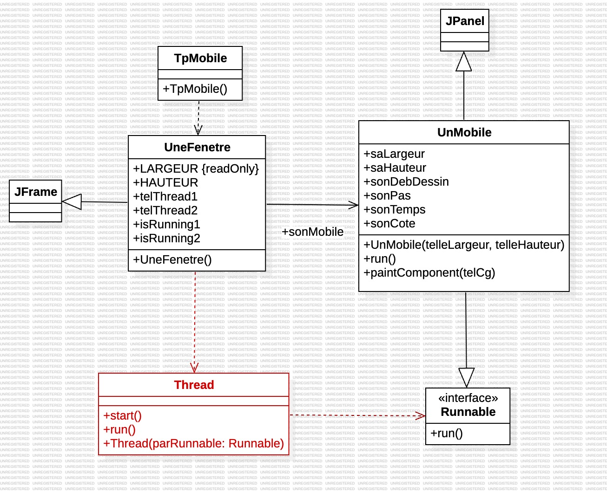

# Rapport TP 1 - Les Threads en Java avec les Mobiles

> Réalisé par Cyril TILAN  
> *La rédaction et la réalisation des TP ont été assistées par des outils d'IA.*

## Table des matières
- [Introduction](#introduction)
- [Diagramme de classes](#diagramme-de-classes)
- [Exercice 1](#exercice-1)
- [Exercice 2](#exercice-2)
- [Exercice 3](#exercice-3)
- [Conclusion](#conclusion)

## Introduction

Ce TP introduit le concept de **programmation parallèle** en Java, en utilisant des threads pour animer des objets mobiles dans une interface graphique. L’objectif est de gérer l'interaction entre les threads et l'interface utilisateur en utilisant des boutons pour contrôler les déplacements des mobiles via les classes `UnMobile` et `UneFenetre`.

La programmation parallèle permet d'exécuter simultanément plusieurs tâches, ce qui est essentiel pour des applications interactives ou demandant des opérations en temps réel. Dans notre cas, les threads sont utilisés pour animer les mobiles de manière indépendante dans une interface graphique. Chaque mobile est contrôlé par un thread qui gère son déplacement et son affichage.

Les principaux points abordés dans ce TP sont :
- Création et gestion de threads en Java.
- Interaction entre les threads et l'interface utilisateur.
- Contrôle des threads via des boutons.
- Gestion de plusieurs objets mobiles de manière indépendante.
- Utilisation de méthodes dépréciées pour mettre en pause et reprendre les threads.
- Utilisation de `GridLayout` pour disposer les éléments dans une interface graphique.
- Création d'un `ActionListener` pour gérer les événements de bouton.

### Diagramme de classes

### Exercice 1

La classe `UnMobile` représente un objet mobile se déplaçant horizontalement dans une interface, animé par un thread contrôlant son mouvement. Dans la méthode `run()`, une boucle déplace le mobile en appelant `repaint()` à intervalles réguliers.

Dans cette boucle :
- La position du mobile (`sonDebDessin`) est incrémentée par `sonPas` pour déplacer l’objet vers la droite.
- La méthode `repaint()` est appelée pour rafraîchir la position.
- La méthode `sleep()` suspend temporairement le thread, contrôlant la vitesse du déplacement.

Pour que le mobile fasse un aller-retour, deux boucles `for` successives sont utilisées : la première pour avancer vers la droite, et la seconde pour revenir vers la gauche. À chaque itération, `repaint()` et `sleep()` gèrent le mouvement fluide et continu sans nécessiter de variable de direction.

### Exercice 2

Dans cet exercice, un bouton est ajouté pour contrôler l'animation du mobile en utilisant `suspend()` et `resume()` de la classe `Thread`.

- **Ajout d’un bouton** : Un bouton `sonBouton` est ajouté à gauche de la fenêtre, avec l'étiquette "Stop" par défaut.
- **Contrôle du Thread** : Un `ActionListener` gère l’état du thread.
    - Si le mobile est en mouvement, un clic sur le bouton appelle `suspend()` pour arrêter l'animation et modifie l’étiquette en "Start".
    - Si le mobile est arrêté, un clic relance l’animation via `resume()` et rétablit l'étiquette "Stop".

*Remarque : `suspend()` et `resume()` sont des méthodes dépréciées.*

Ce bouton permet de mettre en pause et de relancer le mobile, ajoutant un contrôle interactif.

### Exercice 3

Pour cet exercice, `UneFenetre` a été modifiée pour utiliser un `GridLayout` et afficher deux instances de `UnMobile`, chacune avec son bouton de contrôle.

#### Modifications de la disposition
Le `BorderLayout` est remplacé par un `GridLayout` (2x2), permettant de placer chaque mobile et son bouton dans une disposition en grille.

#### Ajout d’un deuxième mobile
Deux instances de `UnMobile` (`sonMobile1` et `sonMobile2`) et leurs boutons (`sonBouton1` et `sonBouton2`) sont ajoutées. Chaque bouton contrôle l'animation de son mobile en utilisant un `ActionListener` distinct, qui utilise `suspend()` et `resume()` sur leurs threads respectifs.

Ce système permet de contrôler indépendamment chaque mobile dans la grille.

## Conclusion

Ce TP a permis de découvrir les bases de la programmation parallèle en Java, en utilisant des threads pour animer des objets mobiles dans une interface graphique. Nous avons appris à gérer l'interaction entre les threads et l'interface utilisateur via des boutons, à mettre en pause et reprendre les animations, et à gérer plusieurs objets de manière indépendante dans une interface.