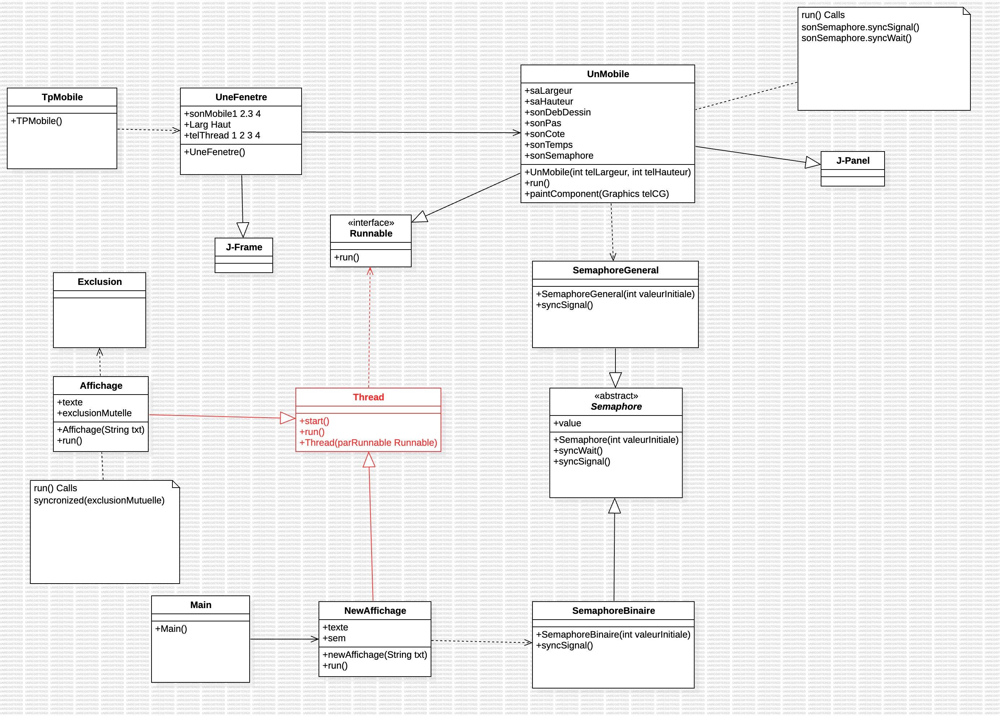

# Rapport TP 2 - Semaphores et gestion des ressources partagées

> Réalisé par Cyril TILAN  
> *La rédaction et la réalisation des TP ont été assistées par des outils d'IA.*

## Table des matières
- [Introduction](#introduction)
- [Le fonctionnement des sémaphores](#le-fonctionnement-des-sémaphores)
- [Comparaison avec le TP 1](#comparaison-avec-le-tp-1)
    - [Points Clés](#points-clés)
    - [Comparaison Synthétique](#comparaison-synthétique)
- [Diagramme de classes](#diagramme-de-classes)
- [Détails des classes](#détails-des-classes)
    - [Main.java](#mainjava)
    - [NewAffichage.java](#newaffichagejava)
    - [Affichage.java](#affichagejava)
    - [SemaphoreBinaire.java](#semaphorebinairejava)
    - [Semaphore.java](#semaphorejava)
    - [TpMobile.java](#tpmobilejava)
    - [UnMobile.java](#unmobilejava)
    - [SemaphoreGeneral.java](#semaphoregeneraljava)
    - [UneFenetre.java](#unefenetrejava)
- [Conclusion](#conclusion)

## Introduction

Un sémaphore est un moyen de contrôler l'accès à une ressource partagée pour éviter les conflits et optimiser l'utilisation des ressources d'un programme. Il utilise une variable entière pour réguler cet accès, avec deux types de sémaphores :
1. **Sémaphore binaire** : ne prend que deux valeurs (0 ou 1) et agit comme un verrou. Il est utile pour assurer l'accès exclusif à une ressource.
2. **Sémaphore général** : peut prendre des valeurs supérieures à 1, permettant de définir un nombre maximal de threads pouvant accéder à une ressource simultanément.

Ce TP a pour but de comprendre et appliquer l'utilisation de sémaphores dans un affichage multi-threadé, en créant un programme d'affichage qui montre les entrées et sorties en ressource critique et en étendant l'application créée dans le TP précédent.

## Le fonctionnement des sémaphores

Les sémaphores reposent sur deux opérations :
- **Wait()** (ou **P**) : réduit la valeur du sémaphore. Si elle devient négative, le thread attend l'accès à la ressource.
- **Signal()** (ou **V**) : augmente la valeur du sémaphore, libérant la ressource et permettant à un autre thread en attente d'y accéder.

En Java, les sémaphores garantissent qu'un seul thread à la fois puisse entrer dans une section critique.

## Comparaison avec le TP 1

Dans `TP_2/UnMobile.java`, les sémaphores jouent un rôle essentiel en régulant l'accès à la section centrale où les mobiles se déplacent. Ce mécanisme garantit qu'un seul mobile à la fois peut entrer dans cette zone critique, évitant ainsi tout risque de collision.

### Points Clés
- **Déclaration du Sémaphore** : Un `SemaphoreGeneral` statique est défini pour être accessible à toutes les instances de `UnMobile`, servant d'outil central de gestion de l’accès à la zone critique.
- **Utilisation du Sémaphore** :
    - **syncWait** : Appelée avant qu’un mobile entre dans la section centrale. Si un autre mobile y est déjà, le mobile actuel attend.
    - **syncSignal** : Appelée une fois que le mobile a traversé la section centrale, indiquant que la zone est libre.

Dans `TP_1/UnMobile.java`, il n'y a pas d'utilisation de sémaphores, donc les mobiles se déplacent sans restriction. Ils se déplacent d'un point A à un point B sans coordination ni gestion d'accès.

### Comparaison Synthétique
- **TP_2/UnMobile.java** : Utilise des sémaphores pour assurer qu'un seul mobile occupe la section centrale à la fois, garantissant ainsi une gestion efficace et sécurisée du mouvement.
- **TP_1/UnMobile.java** : Les mobiles se déplacent librement sans restriction, simplifiant l'implémentation mais sans réguler les accès simultanés.

## Diagramme de classes

## Détails des classes

### Main.java

**But** : Classe d'entrée de l'application.

**Utilisation du sémaphore** : N'est pas utilisée directement pour l'affichage, mais gère les threads d'affichage.

Chaque thread suit un cycle structuré :
- Appel à `syncWait` avant d'entrer dans la section critique, réduisant la valeur du sémaphore. Si elle est déjà à 0, le thread attend.
- Une fois dans la section critique, le thread exécute une tâche d'affichage.
- À la fin, le thread appelle `syncSignal` pour libérer la section critique et permettre à un autre thread d'y accéder.

### NewAffichage.java

**But** : Classe représentant un thread d'affichage, utilisant la classe `SemaphoreBinaire` pour gérer l'exclusion mutuelle.

**Utilisation du sémaphore** : `NewAffichage` utilise un sémaphore binaire pour contrôler l'accès à la section critique. La méthode `run` appelle `syncWait` avant d'afficher le texte, puis `syncSignal` pour libérer la ressource. Cela garantit que seul un thread à la fois peut afficher le texte, évitant les conflits d'accès.

### Affichage.java

**But** : Représente un autre type de thread d'affichage avec gestion explicite de l'exclusion mutuelle.

**Utilisation du sémaphore** : Contrairement à `NewAffichage`, cette classe utilise un objet `Exclusion` pour assurer une exclusion mutuelle explicite. Même si plusieurs instances de `Affichage` sont lancées, le verrou d'exclusion garantit que seul un thread à la fois peut afficher le texte.

### SemaphoreBinaire.java

**But** : Classe représentant un sémaphore binaire, qui ne peut prendre que les valeurs 0 ou 1.

**Utilisation du sémaphore** : `SemaphoreBinaire` étend la classe abstraite `Semaphore` pour restreindre l'accès à une ressource unique. La méthode `syncSignal` est redéfinie pour s'assurer que la valeur du sémaphore ne dépasse jamais 1, maintenant ainsi l'exclusivité de la ressource partagée.

### Semaphore.java

**But** : Classe abstraite de base fournissant les méthodes essentielles `syncWait` et `syncSignal`.

**Utilisation du sémaphore** : La classe `Semaphore` contient la logique centrale de synchronisation, gérant l'état du sémaphore via des méthodes synchronisées. La méthode `syncWait` réduit la valeur du sémaphore, indiquant qu'un thread utilise la ressource. Si la valeur est 0, le thread est mis en attente. La méthode `syncSignal` augmente la valeur, libérant la ressource pour un autre thread.

Cette structure permet aux classes dérivées, comme `SemaphoreBinaire`, d'adapter le comportement tout en utilisant les fonctionnalités de base (par exemple, limiter la valeur à 1 pour un sémaphore binaire).

### TpMobile.java

**But** : Classe principale de l'application, gérant les threads d'affichage et les mobiles.

**Utilisation du sémaphore** : Aucune

### UnMobile.java

**But** : Classe représentant un mobile se déplaçant dans une zone centrale.

**Utilisation du sémaphore** : `UnMobile` utilise un sémaphore général pour contrôler l'accès à la zone centrale. La méthode `run` appelle `syncWait` avant d'entrer dans la zone, puis `syncSignal` pour en sortir. Cela garantit qu'un seul mobile à la fois peut occuper la zone centrale, évitant les collisions.

### SemaphoreGeneral.java

**But** : Classe représentant un sémaphore général, qui peut prendre des valeurs supérieures à 1.

**Utilisation du sémaphore** : `SemaphoreGeneral` étend la classe abstraite `Semaphore` pour gérer l'accès à une ressource partagée par plusieurs threads. La méthode `syncSignal` est redéfinie pour permettre des valeurs supérieures à 1, contrôlant ainsi le nombre de threads pouvant accéder à la ressource simultanément.

### UneFenetre.java

**But** : Classe représentant une fenêtre d'affichage.

**Utilisation du sémaphore** : `UneFenetre` n'utilise pas directement de sémaphores, mais elle gere les threads d'affichage et les mobiles, permettant de visualiser l'interaction entre les threads et les ressources partagées.

## Conclusion

Ce TP nous a permis de mieux comprendre et appliquer des concepts de synchronisation et d'exclusion mutuelle via les sémaphores, éléments essentiels dans la gestion des ressources partagées. Nous avons étudié les sémaphores binaires et généraux, ainsi que leurs implémentations pour mieux contrôler l'accès aux sections critiques dans un environnement multi-threadé. Les différentes classes illustrent l'importance de la synchronisation pour l'affichage séquentiel et la prévention des conflits d'accès, et montrent l'efficacité des sémaphores pour assurer la cohérence dans les opérations concurrentes, un savoir essentiel pour optimiser et sécuriser les programmes multithreadés.