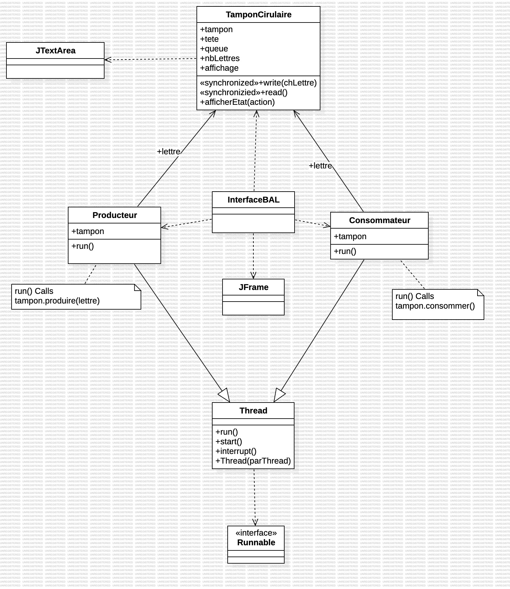

# Rapport TP 3 - Illustration d'un modèle producteur consommateur simple

> Réalisé par Cyril TILAN
> *La rédaction et la réalisation des TP ont été assistées par des outils d'IA.*

## Table des matières

- [Introduction](#introduction)
- [Exercice 1](#exercice-1)
    - [Diagramme de classes](#diagramme-de-classes)
    - [Question 1](#question-1)
    - [Question 2](#question-2)
- [Exercice 2](#exercice-2)
- [Conclusion](#conclusion)

## Introduction

Ce TP illustre le concept de **synchronisation** en Java, en utilisant un modèle simple de **producteur-consommateur** pour gérer des ressources partagées. L'objectif est de contrôler l'accès à une boite aux lettres partagée entre un producteur et un consommateur, en utilisant des threads et verrous pour garantir une gestion sécurisée des ressources.

Le modèle producteur-consommateur est un cas classique de synchronisation multi-thread, où un producteur ajoute des éléments à une boite aux lettres partagée et un consommateur les retire. La synchronisation est essentielle pour éviter les conflits d'accès et garantir que le producteur et le consommateur n'interfèrent pas entre eux.

Les principaux points abordés dans ce TP sont :
- Création de threads producteur et consommateur.
- Utilisation de verrous pour contrôler l'accès à une boite aux lettres partagée.
- Gestion de la synchronisation entre les threads pour éviter les conflits d'accès.
- Utilisation de méthodes `wait()` et `notifyAll()` pour gérer l'attente et la notification des threads.
- Implémentation d'une boite aux lettres partagée pour stocker les éléments produits.
- Création d'un tampon circulaire pour stocker les éléments produits de manière circulaire.
- Utilisation d'une interface graphique pour afficher les éléments ajoutés et retirés de la boite aux lettres.

## Exercice 1

### Diagramme de classes

Le diagramme de classes ci-dessous illustre la structure des classes implémentées dans l'exercice 1 :

### Question 1

Dans cet exercice, nous avons créé une classe `Producteur` qui ajoute des éléments à une boite aux lettres partagée. Le producteur utilise un verrou pour contrôler l'accès à la boite aux lettres et notifie le consommateur lorsqu'un élément est ajouté.

La classe `Producteur` implémente l'interface `Runnable` et contient une méthode `run()` qui ajoute des éléments à la boite aux lettres. Elle est conçue pour fonctionner en boucle, ajoutant des éléments à la boite aux lettres à intervalles réguliers. Le consommateur attendra que des éléments soient disponibles avant de les retirer. Cette synchronisation garantit que le consommateur ne tente pas de retirer des éléments inexistants. 

- Dans cette classe :

  - La methode va envoyer les lettres de A à H à la boite aux lettres et s'arrêter.
  - Un verrou est acquis pour contrôler l'accès à la boite aux lettres lors l'appel de la méthode `write()`.
  - Un élément est ajouté à la boite aux lettres.
  - Le consommateur est notifié via `notifyAll()` pour lui indiquer qu'un élément est disponible.
  - Le verrou est libéré pour permettre au consommateur d'accéder à la boite aux lettres.

La classe `Consommateur` est similaire à la classe `Producteur`, mais elle retire des éléments de la boite aux lettres. Le consommateur attend que des éléments soient disponibles avant de les retirer, ce qui garantit qu'il ne tente pas de retirer des éléments inexistants.

- Dans cette classe :

  - Un verrou est acquis pour contrôler l'accès à la boite aux lettres lors de l'appel de la méthode `read()`.
  - Un élément est retiré de la boîte aux lettres.
  - Le verrou est libéré pour permettre au producteur d'ajouter de nouveaux éléments.

La classe `BAL` (Boîte Aux Lettres) représente la boite aux lettres partagée entre le producteur et le consommateur. Elle contient une liste d'éléments et des méthodes pour ajouter et retirer des éléments de la boite aux lettres.

- Dans cette classe :

    - La méthode `write()` ajoute un élément à la boite aux lettres.
    - La méthode `read()` retire un élément de la boite aux lettres.
    - Les méthodes `wait()` et `notifyAll()` sont utilisées pour gérer l'attente et la notification des threads.

La classe `Main1` crée une instance de la boite aux lettres, du producteur et du consommateur, puis démarre les threads correspondants. Le producteur et le consommateur fonctionnent en parallèle, ajoutant et retirant des éléments de la boite aux lettres de manière synchronisée.

### Question 2

Dans cette question, devions ajouter une classe `ProducteurClavier` qui ajoute des éléments à une boite aux lettres partagée à partir de l'entrée clavier. Le producteur utilise un verrou pour contrôler l'accès à la boite aux lettres et notifie le consommateur lorsqu'un élément est ajouté.

Dans cette classe :
- La méthode `run()` lit les éléments de l'entrée clavier grace à la classe `Scanner` et les ajoute à la boite aux lettres.
- Un verrou est acquis pour contrôler l'accès à la boite aux lettres lors de l'appel de la méthode `write()`.
- Un élément est ajouté à la boite aux lettres.
- Le consommateur est notifié via `notifyAll()` pour lui indiquer qu'un élément est disponible.

La classe `Consommateur`est inchangée par rapport à la question précédente.

La classe `Main2` crée une instance de la boite aux lettres, du producteur et du consommateur, puis démarre les threads correspondants. Le producteur(avec la gestion du clavier) et le consommateur fonctionnent en parallèle, ajoutant et retirant des éléments de la boite aux lettres de manière synchronisée.

## Exercice 2

### Diagramme de classes

Le diagramme de classes ci-dessous illustre la structure des classes implémentées dans l'exercice 2 :

### Question 1

Dans cet exercice, nous devions remplacer la classe `BAL` par une classe `TamponCirculiare` qui implémente un tampon circulaire pour stocker les éléments produits. Le tampon circulaire est un mécanisme de stockage circulaire qui permet d'ajouter et de retirer des éléments de manière circulaire, sans nécessiter de redimensionnement. Nous devions rajouter une interface graphique `InterfaceBAL` pour afficher les éléments ajoutés et retirés du tampon circulaire.

La classe `TamponCirculaire` contient un tableau circulaire pour stocker les éléments produits, ainsi que des indices pour suivre la tête et la queue du tampon. Les méthodes `produire()` et `consommer()` ajoutent et retirent des éléments du tampon circulaire, en respectant les contraintes de taille et de position.

Dans cette classe :
- Un tableau circulaire est utilisé pour stocker les éléments produits.
- Les indices `tete` et `queue` suivent la tête et la queue du tampon.
- La méthode `produire()` ajoute un élément à la queue du tampon.
- La méthode `consommer()` retire un élément de la tête du tampon.
- Les méthodes `wait()` et `notifyAll()` sont utilisées pour gérer l'attente et la notification des threads.
- Les méthodes `estPlein()` et `estVide()` vérifient si le tampon est plein ou vide.

La classe `Producteur` et la classe `Consommateur` sont modifiées pour utiliser le tampon circulaire à la place de la boite aux lettres. Le producteur ajoute des éléments à la queue du tampon, tandis que le consommateur les retire de la tête.

La classe `InterfaceBAL` est une interface graphique qui affiche les éléments ajoutés et retirés du tampon circulaire. Elle contient des zones de texte pour afficher les éléments produits et consommés, ainsi que des boutons pour démarrer et arrêter la production et la consommation.

Dans cette classe :
- Des zones de texte sont utilisées pour afficher les éléments produits et consommés.
- Des boutons
- Un `ActionListener` est utilisé pour gérer les événements de bouton.

## Conclusion

Ce TP a permis d'illustrer le concept de synchronisation en Java en utilisant un modèle simple de producteur-consommateur. La gestion des threads et des verrous a permis de contrôler l'accès à une boite aux lettres partagée entre un producteur et un consommateur, garantissant une gestion sécurisée des ressources. L'implémentation d'un tampon circulaire a permis de stocker les éléments produits de manière circulaire, facilitant l'ajout et le retrait d'éléments de manière synchronisée. L'interface graphique a permis de visualiser les éléments ajoutés et retirés du tampon circulaire, offrant une représentation visuelle de la synchronisation entre les threads.

