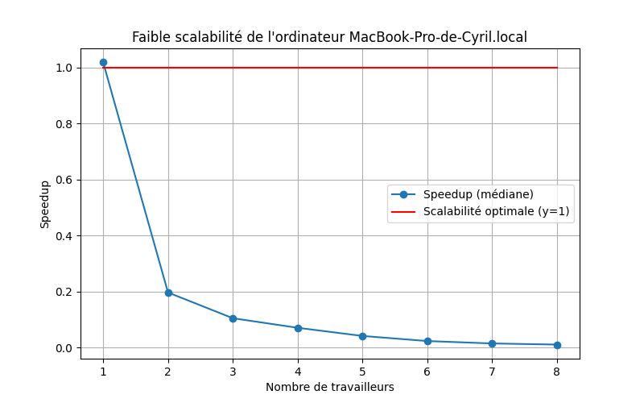
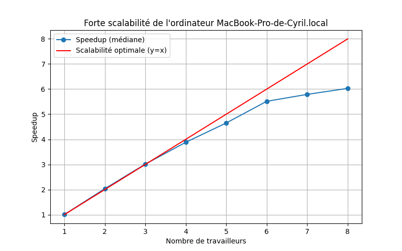
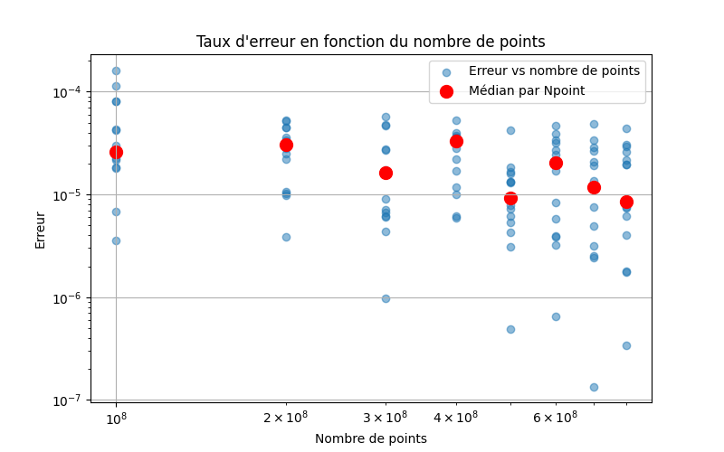

# Rapport TP 4 - Monte Carlo, Parallélisation et Qualité de code

> Réalisé par Cyril TILAN.
> *La rédaction et la réalisation des TP ont été assistées par des outils d'IA.*

## Table des matières

- [1. Méthode de Monte Carlo pour calculer Pi](#methode-de-monte-carlo-pour-calculer-pi)
- [2. Analyse Algorithmique et Parallélisation](#analyse-algorithmique-et-parallélisation)
    - [A. Solution n°1 :Itération parallèle](#solution-n1--itération-parallèle)
    - [B. Solution n°2 : Master/Worker](#solution-n2--masterworker)
- [3. Application des solutions sur machine](#application-des-solutions-sur-machine)
    - [Analyse de Pi.java](#analyse-de-pijava)
    - [Analyse de Assignment102.java](#analyse-de-assignement102java)
    - [Comparaison avec la classe Pi.java](#comparaison-avec-la-classe-pijava)
- [4. Expérimentation des solutions sur machine](#expérimentation-des-solutions-sur-machine)
    - [A. Automatisation du calcul de performance](#automatisation-du-calcul-de-performance)
    - [B. Tests de scalabilité](#tests-de-scalabilité)
    - [C. Résultats des tests de scalabilité](#résultats-des-tests-de-scalabilité)
- [5. Mise en œuvre et performance Master/Worker en mémoire distribuée](#mise-en-oeuvre-et-performance-masterworker-en-mémoire-distribuée)
    - [A. Mise en œuvre de Master/Worker en mémoire distribuée](#mise-en-oeuvre-de-masterworker-en-mémoire-distribuée)
    - [B. Performance de Master/Worker en mémoire distribuée](#performance-de-masterworker-en-mémoire-distribuée)
    - [C. Résultats des tests de performance de l'algorithme en Master/Worker en mémoire distribuée](#résultats-des-tests-de-performance-de-lalgorithme-en-masterworker-en-mémoire-distribuée)
- [6. Analyse globale des résultats](#analyse-global-des-résultats)
- [7. Mise en place de Master/Worker en mémoire distribuée sur un cluster](#mise-en-place-de-masterworker-en-mémoire-distribuée-sur-un-cluster)
- [8. Qualité de développement](#qualité-de-développement)
    - [A. Introduction aux Normes ISO](#introduction-aux-normes-iso)
    - [B. Historique des normes ISO](#historique-des-normes-iso)
    - [C. Schéma de la norme ISO 25010](#schéma-de-la-norme-iso-25010)
    - [D. Qu'en est il de notre projet ?](#quen-est-il-de-notre-projet)
    - [E. Conclusion](#conclusion)


## **1. Méthode de Monte Carlo pour calculer Pi**

La méthode de Monte Carlo est une méthode probabiliste qui permet de calculer une valeur approchée d'une intégrale ou d'une probabilité. On l'utilise pour calculer Pi en générant des points aléatoires dans un carré et en comptant le nombre de points qui se trouvent dans le cercle inscrit dans ce carré.

Soit $A_{1/4d}$ l'aire du quart de disque de rayon 1 :

$A_{1/4d} = \frac{\pi r^2}{4}= \frac{\pi}{4}$

Soit $A_{c}$ l'aire du carré de côté 1 :

$A_{c} = 1$

On considère un point $Xp(xp, yp)$ généré aléatoirement dans le carré qui suit la loi uniforme $U([0,1])$.

Le point $Xp$ a une probabilité de $\frac{A_{1/4d}}{A_{c}} = \frac{\pi}{4}$ de se trouver dans le quart de disque.


*Graphique de la méthode de Monte Carlo pour calculer Pi*

Pour estimer $\pi$, on génère $N_{total}$ points aléatoires dans le carré et on compte le nombre de points qui se trouvent dans le quart de disque soit à distance de 1 de l'origine nommée $N_{cible}$.

Si $N_{total}$ est suffisamment grand, on peut estimer $\pi$ par la fréquence $\frac{N_{cible}}{N_{total}}$ qui converge vers la probabilité $P$ soit :

$P = \frac{N_{cible}}{N_{total}} \approx \frac{\pi}{4}$

On en déduit que :

$\pi \approx 4 \times P$

Donc plus $N_{total}$ est grand, plus l'estimation de $\pi$ est précise.

## **2. Analyse Algorithmique et Parallélisation**

Une problématique récurrente en informatique est l'optimisation des algorithmes pour réduire le temps de calcul. Nous allons analyser deux algorithmes de Monte Carlo et essayer de réduire leur temps de calcul. 

### **A. Solution n°1 : Itération parallèle**

La première solution consiste à paralléliser l'algorithme de Monte Carlo en utilisant des threads

Voici l'algorithme en **code séquentiel** :

```
int n_cible = 0;
for (int point = 0; point < n_total; point++) {
    double x_point = Math.random(); // Génère un nombre aléatoire entre ]0;1[
    double y_point = Math.random();
    if (Math.pow(x_point, 2) + Math.pow(y_point, 2) < 1) {
        n_cible++;
    }
}
double pi = 4 * (double) N_cible / N_total;
```
*Algorithme de Monte Carlo en code séquentiel*

Dans cet algorithme, on génère $N_{total}$ points aléatoires et on compte le nombre de points qui se trouvent dans le quart de disque. On estime ensuite $\pi$ en fonction de la fréquence des points dans le quart de disque. Pour paralléliser cet algorithme, on identifie les tâches indépendantes qui peuvent être exécutées en parallèle.

#### **Taches identifiées** :

1. **Tâche principale :** Générer et compter $N_{total}$ points aléatoires.
   - **Sous-tâche 1 :** Générer un point aléatoire avec les variables $x_{point}$ et $y_{point}$.
   - **Sous-tâche 2 :** Vérifier si le point est dans le quart de disque et incrémenter $N_{cible}$.

2. **Tache secondaire :** Calculer $\pi$ en fonction de $N_{cible}$ et $N_{total}$.

#### **Taches dépendantes** :

- La tâche principale dépend de la tâche secondaire pour calculer $\pi$.
- La sous-tâche 2 dépend de la sous-tâche 1 pour générer un point aléatoire.
- Indépendance parallèle des sous-tâches 1 et 2 :
    - Les sous-tâches 1 peuvent être exécutées en parallèle, car chaque point est généré indépendamment des autres points.
    - Les sous-tâches 2 peuvent être exécutées en parallèle, car chaque point est vérifié indépendamment des autres points.

On a donc identifié une section critique. On peut maintenant identifier les ressources partagées et les ressources critiques.

#### **Section critique** :

- La variable $N_{cible}$ est partagée entre les sous-tâches 2.

#### **Ressources partagées** :

- La variable $N_{cible}$ est protégée par un verrou pour éviter les accès concurrents.

#### **Algorithme parallèle** :

L'algorithme parallèle repose donc sur une fonction nommée `generatePoint()` qui génère un point aléatoire et renvoie un booléen indiquant si le point est dans le quart de disque :

```
boolean generatePoint() {
    double x_point = Math.random();
    double y_point = Math.random();
    return Math.pow(x_point, 2) + Math.pow(y_point, 2) < 1;
}

int n_cible = 0;
for (int point = 0; point < n_total; point++) {
    if (generatePoint()) {
        n_cible++;
    }
}
```
*Algorithme de Monte Carlo en code parallèle*

L'avantage de cette fonction est qu'elle ne dépend pas des autres points et peut être exécutée en parallèle.

### **B. Solution n°2 : Master/Worker**

La deuxième solution consiste à paralléliser l'algorithme de Monte Carlo en utilisant un modèle Master/Worker. Dans ce modèle, un processus maître génère des tâches et les envoie à des processus esclaves totalement indépendants. Les processus esclaves effectuent les tâches et renvoient les résultats au processus maître.


*Schéma du modèle Master/Worker*

Voici comment on pourrait appliquer le modèle Master/Worker à l'algorithme de Monte Carlo :

```
fonction generatePoint() {
    double x_point = Math.random();
    double y_point = Math.random();
    return Math.pow(x_point, 2) + Math.pow(y_point, 2) < 1;
}

fonction worker(n_total) {
    int n_cible = 0;
    for (int point = 0; point < n_total; point++) {
        if (generatePoint()) {
            n_cible++;
        }
    }
    return n_cible;
}

fonction master(n_total, n_workers) {
    int tableauCibles = [NULL for workers n_workers];
    int n_total_per_worker = n_total / n_workers;
    for (int worker = 0; worker < n_workers; worker++) {
        tableauCibles[worker] = worker(n_total_per_worker);
    }
    int n_cible = 0;
    for (int worker = 0; worker < n_workers; worker++) {
        n_cible += tableauCibles[worker];
    }
    return n_cible;
}

int n_total = 1000000;
int n_workers = 4;
int n_cible = master(n_total, n_workers);
double pi = 4 * (double) n_cible / n_total;
System.out.println(pi);
```

*Algorithme de Monte Carlo en code Master/Worker en langage pseudo Java*

Dans cet algorithme, le processus maître divise les tâches en $n_{workers}$ tâches et les envoie à des processus esclaves. Les processus esclaves exécutent les tâches et renvoient les résultats au processus maître. Le processus maître calcule ensuite $\pi$ en fonction des résultats des processus esclaves.

#### **Avantages du modèle Master/Worker** :

- Réduction des conflits de ressources (comparé à la solution A).
- Parallélisation des tâches indépendantes.
- Possibilité de scalabilité étant donné que le nombre de workers peut être augmenté. (Voir Partie 4)
- Possibilité de répartir les tâches sur plusieurs machines.

#### **Inconvénients du modèle Master/Worker** :

- Complexité de mise en place.
- Risque de surcharge du processus maître.
- Risque de dépendance entre les tâches.
- Risque de perte de données.

## **3. Application des solutions sur machine**

Nous allons maintenant appliquer les solutions proposées sur une machine pour comparer les performances des algorithmes séquentiel, parallèle et Master/Worker. L'objectif est de mesurer le temps d'exécution de chaque algorithme et de comparer leur approche et verifier si elles appliquent bien les principes présentés dans la partie précédente.

### **Analyse de Pi.java**

L'algorithme de Monte Carlo implémenté dans le fichier `Pi.java` utilise ce qu'on appelle des `Future` pour paralléliser les tâches.

#### **Qu'est-ce que sont les `Future` ?**

Les `Future` sont des containers qui permettent de récupérer le résultat d'une tâche asynchrone :
- Il permet de soumettre une tâche à un `ExecutorService` et de récupérer un `Future` qui représente le résultat de la tâche.
- On peut récupérer le résultat de la tâche en appelant la méthode `get()` sur le `Future`.
- Il permet de verifier l'état d'exécution de la tâche avec les méthodes `isDone()`, `isCancelled()` et `cancel()`.

Dans notre cas, on utilise les `Future` pour paralléliser les tâches de génération de points aléatoires et de comptage des points dans le quart de disque en garantissant l'indépendance des tâches.


*Diagramme de classe de Pi.java*

#### **Analyse du modèle utilisé ainsi que du paradigme de programmation** :

- Le modèle utilisé est le modèle Master/Worker. Il permet de répartir les tâches entre plusieurs `Worker` et de récupérer les résultats grace aux `Future` pour calculer $\pi$.
- Le paradigme de programmation est basé sur la gestion des tâches explicites via les `Callable`.

#### **Structure de l'algorithme**:

1. Parallélisation des tâches avec les `Callable` :
   - Les processus `Worker` sont implémentés par des `Callable` qui génèrent des points aléatoires et comptent les points dans le quart de disque.
   - Ces `Callable` sont exécutés par un `FixedThreadPool` qui permet de répartir les tâches entre plusieurs threads.

2. Récupération des résultats avec les `Future` :
    - Lorsqu'un `Callable` est soumis au `FixedThreadPool`, il renvoie un `Future` qui permet de récupérer le résultat de la tâche.
    - Les `Future` permettent de récupérer les résultats des `Worker` et de les ajouter à une liste de résultats.
    - On peut ensuite calculer $\pi$ en fonction des résultats des `Worker`.

#### **Quel est le lien entre la classe `Pi.java` et le modèle Master/Worker ?**

La classe `Pi.java` suit le modèle Master/Worker expliqué précédemment :
- La classe `Pi.java` est le processus maître qui divise les tâches en `Worker` et récupère les résultats.
- Les `Worker` sont les `Callable` qui génèrent des points aléatoires et comptent les points dans le quart de disque.
- Les `Future` permettent de récupérer les résultats des `Worker` et de les ajouter à une liste de résultats.
- Le `master` divise équitablement les taches grâce à la variable `n_workers`.


### **Analyse de Assignment102.java**

L'algorithme de Monte Carlo implémenté dans le fichier `Assignement102.java` appelle l'API `Concurrent` pour paralléliser la génération des points aléatoires, les compter et calculer $\pi$.

#### **Qu'est-ce que l'API `Concurrent` ?**

L'API `Concurrent` est une API qui permet de gérer les tâches concurrentes en Java :
- Elle fournit des classes et des interfaces pour gérer les tâches concurrentes, les threads et les exécuteurs.
- Elle permet de paralléliser les tâches.
- Elle permet de gérer les tâches asynchrones et les tâches qui dépendent les unes des autres.

Dans notre cas, on utilise l'API `Concurrent` pour paralléliser les tâches de génération de points aléatoires et de comptage des points dans le quart de disque en garantissant l'indépendance des tâches.


*Diagramme de classe de Assignment102.java*

#### **Analyse du modèle utilisé ainsi que du paradigme de programmation** :

- Le modèle utilisé est le modèle d'itération parallèle. Il permet de paralléliser les tâches de génération de points aléatoires et de comptage des points de manière indépendante soumise à un pool de threads.
- Le paradigme de programmation est basé sur le modèle d'itération parallèle. Il permet de paralléliser les tâches de manière indépendante.

#### **Structure de l'algorithme**:

1. **Gestions des tâches avec un `ExecutorService` :**
    - Les tâches de génération de points aléatoires et de comptage des points sont soumises à un `ExecutorService` qui permet de répartir les tâches entre plusieurs threads.
    - Chaque génération de point aléatoire et chaque comptage de point est exécuté de manière indépendante avec un `Runnable`.
2. **Synchronisation des tâches avec un `AtomicInteger` :**
    - La variable `nAtomSucces` est un `AtomicInteger` qui permet de compter les points dans le quart de disque de manière atomique pour éviter les accès concurrents.

#### **Quel est le lien entre la classe `Assignment102.java` et le modèle d'itération parallèle ?**

La classe `Assignment102.java` suit le modèle d'itération parallèle expliqué précédemment :
- Les tâches de génération de points aléatoires et de comptage des points sont exécutées de manière indépendante.
- Chaque génération de point aléatoire et chaque comptage de point est exécuté de manière indépendante avec un `Runnable`.
- La variable `n_cible` est remplacée par `nAtomSucces`, un `AtomicInteger` qui permet de compter les points dans le quart de disque de manière atomique pour éviter les accès concurrents.

#### **Comparaison avec la classe `Pi.java` :**

1. **Utilisation de l'API `Concurrent` :**
    - `Assignment102.java` utilise l'API `Concurrent` pour gérer les tâches concurrentes ce qui nécessite l'appel d'un `AtomicInteger` pour gérer les accès concurrents.
    - `Pi.java` utilise les `Future` pour gérer les tâches concurrentes réduisant le cout de gestion des threads.

2. **Modèle de programmation :**
    - `Assignment102.java` suit le modèle d'itération parallèle.
    - `Pi.java` suit le modèle Master/Worker.

3. **Complexité de mise en place :**
    - `Assignment102.java` est plus simple à mettre en place, car il utilise l'API `Concurrent` qui gère les tâches concurrentes.
    - `Pi.java` est plus complexe à mettre en place, car il utilise les `Future` pour gérer les tâches concurrentes.

## **4. Expérimentation des solutions sur machine**

Nous allons maintenant expérimenter les solutions proposées sur une machine pour comparer les performances des algorithmes séquentiel, parallèle et Master/Worker. L'objectif est de mesurer le temps d'exécution de chaque algorithme et de comparer leur approche.

L'expérimentation a été réalisée sur une machine avec les caractéristiques suivantes :
- **Processeur :** Apple M1 Pro ARM 64 bits :
  - **Cœurs physiques :** 8 (6 hautes performances, 2 hautes efficacités)
  - **Cœurs logiques (Threads) :** 8
  - **Fréquence :** 3,2 GHz
  - **Cache L1 :** 192 Ko
  - **Cache L2 :** 4 Mo
  - **Cache L3 :** 16 Mo
- **Mémoire :** 16 Go LPDDR5

NB : Les résultats peuvent varier en fonction de la machine utilisée.

### **A. Automatisation du calcul de performance**

Pour automatiser le calcul de performance, j'ai utilisé plusieurs scripts Python (`Executor<nom_algorithme>.py`) qui permettent de lancer les différents algorithmes avec des paramètres définis (nombre de points, nombre de process, etc.) et de mesurer le temps d'exécution ainsi que leur taux d'erreur.

Pour mettre en place cela, j'ai dû modifier les classes `Pi.java`, `Assignment102.java` et `MasterSocket.java` pour qu'elles prennent en compte les paramètres passés en argument.

Une fois terminé, il récupère les résultats et les affiche dans un fichier CSV pour une meilleure visualisation.

### **B. Tests de scalabilité**

Nous allons maintenant tester la scalabilité des algorithmes en augmentant le nombre de points générés et le nombre de process pour voir comment les algorithmes se comportent. L'objectif est de mesurer le temps d'exécution des algorithmes en fonction du nombre de points générés et du nombre de process selon deux scénarios :

1. **Scénario 1 :** Nombre de points générés avec un nombre de process augmentant. (**Scalabilité forte**)
2. **Scénario 2 :** Augmentation du nombre de process proportionnellement aux nombres de points générés. (**Scalabilité faible**)

#### **Scénario 1 : Scalabilité forte**

La scalabilité forte consiste à augmenter le nombre de process tout en gardant le nombre de points fixe. Cela permet de mesurer l'efficacité de l'algorithme en fonction du nombre de process.

On l'évalue grace au **speedup** qui est le rapport entre le temps d'exécution de l'algorithme séquentiel et le temps d'exécution de l'algorithme parallèle.

Sa formule est la suivante :

$Speedup = \frac{Temps_{séquentiel}}{Temps_{parallèle}}$

Pour la scalabilité forte, on s'attend à ce que le speedup augmente avec le nombre de points générés.

Un speedup idéal est linéaire, c'est-à-dire que le gain de performance est proportionnel au nombre de cœurs.


*Courbe de scalabilité forte*

La scalabilité forte est donc mesurée en maintenant le nombre de points générés fixe et en augmentant le nombre de process.

| Nombre de points | Nombre de process | Points par process |
|------------------|-------------------|--------------------|
| 1000000          | 1                 | 1000000            |
| 1000000          | 2                 | 500000             |
| 1000000          | 4                 | 250000             |
| 1000000          | 8                 | 125000             |


#### **Scénario 2 : Scalabilité faible**

La scalabilité faible à l'inverse de la scalabilité forte consiste à augmenter le nombre de process proportionnellement au nombre de points générés. Cela permet de mesurer l'efficacité de l'algorithme en fonction du nombre de process tout en simulant un scénario avec lequel chaque process traite une part fixe de points supplémentaires.

Pour la scalabilité faible, on s'attend à ce que la courbe idéale de speedup soit constante, c'est-à-dire que le gain de performance reste constant même avec un nombre croissant de process.

On augmente le nombre de process proportionnellement au nombre de points générés de manière que chaque process traite une part constante de points.

| Nombre de points | Nombre de process | Points par process |
|------------------|-------------------|--------------------|
| 1000000          | 1                 | 1000000            |
| 2000000          | 2                 | 1000000            |
| 4000000          | 4                 | 1000000            |
| 8000000          | 8                 | 1000000            |


### **C. Résultats des tests de scalabilité**

#### **1. Pi.java**

Pour `Pi.java`, j'ai dû modifier la méthode `main` pour qu'elle prenne en compte les paramètres passés en argument. Cependant, elle prenait deja un nombre fixe de process comparé à `Assignment102.java` qui choisissait le nombre de process en fonction du nombre de cœurs disponibles. J'ai rajouté aussi une classe `WriteCSV.java` pour écrire les résultats dans un fichier CSV.

| Nombre de points | Nombre de process | Temps d'exécution (ms) | Approximation de Pi | Taux d'erreur |
|------------------|-------------------|------------------------|---------------------|---------------|
| 40000000         | 1                 | 1312                   | 3.1415727000        | 0.0000063514  |
| 40000000         | 1                 | 1306                   | 3.1419192000        | 0.0001039430  |
| 40000000         | 1                 | 1305                   | 3.1413376000        | 0.0000811861  |
| 40000000         | 1                 | 1304                   | 3.1415946000        | 0.0000006196  |
| 40000000         | 1                 | 1303                   | 3.1412748000        | 0.0001011759  |
| 40000000         | 1                 | 1314                   | 3.1415117000        | 0.0000257683  |
| 40000000         | 1                 | 1305                   | 3.1416362000        | 0.0000138613  |
| 40000000         | 1                 | 1301                   | 3.1413661000        | 0.0000721142  |
| 40000000         | 1                 | 1514                   | 3.1417768000        | 0.0000586156  |
| 40000000         | 1                 | 1304                   | 3.1415199000        | 0.0000231582  |
| 40000000         | 1                 | 1306                   | 3.1414204000        | 0.0000548300  |
| 40000000         | 1                 | 1283                   | 3.1416095000        | 0.0000053624  |
| 40000000         | 1                 | 1315                   | 3.1415837000        | 0.0000028500  |
| 40000000         | 1                 | 1283                   | 3.1414611000        | 0.0000418748  |
| 40000000         | 1                 | 1409                   | 3.1415880000        | 0.0000014813  |
| 40000000         | 2                 | 665                    | 3.1414794000        | 0.0000360497  |
| 40000000         | 2                 | 664                    | 3.1415228000        | 0.0000222351  |
| 40000000         | 2                 | 665                    | 3.1419633000        | 0.0001179804  |
| 40000000         | 2                 | 676                    | 3.1421754000        | 0.0001854939  |
| 40000000         | 2                 | 672                    | 3.1415926000        | 0.0000000171  |
| 40000000         | 2                 | 667                    | 3.1418163000        | 0.0000711889  |
| 40000000         | 2                 | 675                    | 3.1415064000        | 0.0000274554  |
| 40000000         | 2                 | 718                    | 3.1415945000        | 0.0000005877  |
| 40000000         | 2                 | 677                    | 3.1415226000        | 0.0000222988  |
| 40000000         | 2                 | 673                    | 3.1414819000        | 0.0000352540  |
| 40000000         | 2                 | 667                    | 3.1415263000        | 0.0000211210  |
| 40000000         | 2                 | 666                    | 3.1413490000        | 0.0000775573  |
| 40000000         | 2                 | 667                    | 3.1414500000        | 0.0000454080  |
| 40000000         | 2                 | 665                    | 3.1414327000        | 0.0000509148  |
| 40000000         | 2                 | 668                    | 3.1412601000        | 0.0001058551  |

*Tableau des résultats de Pi.java pour la scalabilité forte*

NB : Les résultats sont répétés pour plus de précision et calculer une moyenne.

La courbe de scalabilité forte avec 100 000 000 de points de `Pi.java` est la suivante :


On remarque que comme prévu, le speedup **augmente** avec le nombre de points générés. Elle suit une courbe **presque linéaire** ce qui indique une scalabilité forte à peu près correcte. Cependant, on observe une légère baisse du speedup à partir de **6** process. Cela peut être du que la puce M1 Pro contient 6 cœurs hautes performances et 2 cœurs hautes efficacités qui sont moins performants.

Avec 8 process (un cœur logique par cœur physique), l'implémentation atteint une performance équivalente à **6** process. Cela confirme que l'implémentation de `Pi.java` est optimisée et qu'elle tire pleinement parti des ressources de la machine.

**Testons maintenant la scalabilité faible de `Pi.java`.**

| Nombre de points | Nombre de process | Temps d'exécution (ms) | Points par process | Approximation de Pi | Taux d'erreur |
|------------------|-------------------|------------------------|--------------------|---------------------|---------------|
| 100000000        | 1                 | 3239                   | 100000000          | 3.1415420400        | 0.0000161108  |
| 100000000        | 1                 | 3251                   | 100000000          | 3.1416958000        | 0.0000328325  |
| 100000000        | 1                 | 3236                   | 100000000          | 3.1415548400        | 0.0000120364  |
| 100000000        | 1                 | 3233                   | 100000000          | 3.1417420000        | 0.0000475384  |
| 100000000        | 1                 | 3225                   | 100000000          | 3.1416208000        | 0.0000089593  |
| 100000000        | 1                 | 3425                   | 100000000          | 3.1417522800        | 0.0000508107  |
| 100000000        | 1                 | 3257                   | 100000000          | 3.1416109200        | 0.0000058144  |
| 100000000        | 1                 | 3251                   | 100000000          | 3.1416688800        | 0.0000242636  |
| 100000000        | 1                 | 3246                   | 100000000          | 3.1417282000        | 0.0000431458  |
| 100000000        | 1                 | 3227                   | 100000000          | 3.1414628400        | 0.0000413209  |
| 100000000        | 1                 | 3223                   | 100000000          | 3.1415479600        | 0.0000142264  |
| 100000000        | 1                 | 3227                   | 100000000          | 3.1415214000        | 0.0000226807  |
| 100000000        | 1                 | 3228                   | 100000000          | 3.1419103200        | 0.0001011164  |
| 100000000        | 1                 | 3224                   | 100000000          | 3.1414577200        | 0.0000429507  |
| 100000000        | 1                 | 3254                   | 100000000          | 3.1414237600        | 0.0000537605  |
| 200000000        | 2                 | 3375                   | 100000000          | 3.1416762000        | 0.0000265936  |
| 200000000        | 2                 | 3310                   | 100000000          | 3.1417121600        | 0.0000380401  |
| 200000000        | 2                 | 3302                   | 100000000          | 3.1418572800        | 0.0000842332  |
| 200000000        | 2                 | 3311                   | 100000000          | 3.1415497400        | 0.0000136598  |
| 200000000        | 2                 | 3313                   | 100000000          | 3.1415475400        | 0.0000143601  |
| 200000000        | 2                 | 3310                   | 100000000          | 3.1416755200        | 0.0000263772  |
| 200000000        | 2                 | 3326                   | 100000000          | 3.1415385800        | 0.0000172122  |
| 200000000        | 2                 | 3314                   | 100000000          | 3.1416381400        | 0.0000144788  |
| 200000000        | 2                 | 3307                   | 100000000          | 3.1415925000        | 0.0000000489  |
| 200000000        | 2                 | 3309                   | 100000000          | 3.1417120600        | 0.0000380082  |
| 200000000        | 2                 | 3354                   | 100000000          | 3.1415731400        | 0.0000062114  |
| 200000000        | 2                 | 3325                   | 100000000          | 3.1415294200        | 0.0000201279  |
| 200000000        | 2                 | 3299                   | 100000000          | 3.1418042000        | 0.0000673373  |
| 200000000        | 2                 | 3301                   | 100000000          | 3.1415058200        | 0.0000276400  |
| 200000000        | 2                 | 3303                   | 100000000          | 3.1418683200        | 0.0000877473  |

*Tableau des résultats de Pi.java pour la scalabilité faible*

La courbe de scalabilité faible avec 100 000 000 de points de `Pi.java` est la suivante :


On remarque que le speedup **décroit** avec le nombre de process qui **augmente**. Le speedup passe de **1** avec un seul process à environ **0.8** avec 8 process.

Cela indique que l'implémentation de `Pi.java` n'est pas optimisée pour la scalabilité faible. Le gain de performance diminue avec le nombre de process, ce qui signifie que l'implémentation n'est pas capable de tirer pleinement parti des ressources supplémentaires.

**Testons maintenant l'efficacité de `Pi.java` (Effectiveness) en fonction du nombre de points.**

Pour évaluer l'efficacité de `Pi.java` sur l'approximation de Pi, on va analyser un nombre de points repentant la moyenne des taux d'erreur en fonction du nombre de points.


On remarque que l'efficacité de `Pi.java` est assez bonne avec un taux d'erreur moyen entre **$10^{-4}$** et **$10^{-5}$** pour un nombre de points de l'ordre de $10^8$. La médiane des taux d'erreur est d'environ **$10^{-5}$**. Elle a cependant tendance à **décroitre** quand le nombre de points augmente.

#### **2. Assignment102.java**

Pour évaluer la scalabilité de `Assignment102.java`, j'ai dû modifier le code pour qu'il prenne en compte le nombre de process et le nombre de points passés en argument. J'ai également dû modifier le code pour qu'il choisisse le nombre de process de manière fixe au lieu d'utiliser la méthode `Runtime.getRuntime().availableProcessors()`. Comme pour `Pi.java`, j'ai rajouté une classe `WriteCSV.java` pour écrire les résultats dans un fichier CSV.

| Nombre de points | Nombre de process | Temps d'exécution (ms) | Approximation de Pi | Taux d'erreur |
|------------------|-------------------|------------------------|---------------------|---------------|
| 10000000         | 1                 | 736                    | 3.1425584000        | 0.0009657464  |
| 10000000         | 1                 | 744                    | 3.1419192000        | 0.0003265464  |
| 10000000         | 1                 | 738                    | 3.1410732000        | -0.0005194536 |
| 10000000         | 1                 | 757                    | 3.1421536000        | 0.0005609464  |
| 10000000         | 1                 | 748                    | 3.1418344000        | 0.0002417464  |
| 10000000         | 1                 | 737                    | 3.1417220000        | 0.0001293464  |
| 10000000         | 1                 | 747                    | 3.1425468000        | 0.0009541464  |
| 10000000         | 1                 | 746                    | 3.1411528000        | -0.0004398536 |
| 10000000         | 1                 | 721                    | 3.1413404000        | -0.0002522536 |
| 10000000         | 1                 | 732                    | 3.1415068000        | -0.0000858536 |
| 10000000         | 1                 | 767                    | 3.1416092000        | 0.0000165464  |
| 10000000         | 1                 | 740                    | 3.1412772000        | -0.0003154536 |
| 10000000         | 1                 | 739                    | 3.1416084000        | 0.0000157464  |
| 10000000         | 1                 | 760                    | 3.1412780000        | -0.0003146536 |
| 10000000         | 1                 | 757                    | 3.1410764000        | -0.0005162536 |
| 10000000         | 2                 | 1856                   | 3.1415336000        | -0.0000590536 |
| 10000000         | 2                 | 1777                   | 3.1418732000        | 0.0002805464  |
| 10000000         | 2                 | 1754                   | 3.1422584000        | 0.0006657464  |
| 10000000         | 2                 | 1746                   | 3.1409156000        | -0.0006770536 |
| 10000000         | 2                 | 1645                   | 3.1421432000        | 0.0005505464  |
| 10000000         | 2                 | 1707                   | 3.1417208000        | 0.0001281464  |
| 10000000         | 2                 | 1719                   | 3.1421376000        | 0.0005449464  |
| 10000000         | 2                 | 1644                   | 3.1408020000        | -0.0007906536 |
| 10000000         | 2                 | 1675                   | 3.1418192000        | 0.0002265464  |
| 10000000         | 2                 | 1807                   | 3.1419220000        | 0.0003293464  |
| 10000000         | 2                 | 1600                   | 3.1424580000        | 0.0008653464  |
| 10000000         | 2                 | 1624                   | 3.1422260000        | 0.0006333464  |
| 10000000         | 2                 | 1622                   | 3.1409728000        | -0.0006198536 |
| 10000000         | 2                 | 1696                   | 3.1414460000        | -0.0001466536 |
| 10000000         | 2                 | 1608                   | 3.1407196000        | -0.0008730536 |

*Tableau des résultats de Assignment102.java pour la scalabilité forte*

La courbe de scalabilité forte avec 10 000 000 de points de `Assignment102.java` est la suivante :


On remarque que cette fois-ci, le speedup **diminue** avec le nombre de points générés. Elle commence à **1** pour un seul process et se rapproche de **0** avec 8 process.

Cette diminution du speedup est due à plusieurs facteurs :

- **Complexité de l'algorithme :** L'algorithme de Monte Carlo utilisé dans `Assignment102.java` est plus complexe que celui de `Pi.java` ce qui peut ralentir l'exécution.
- **Surcharge de synchronisation :** L'utilisation de l'AtoimcInteger pour compter les points dans le quart de disque peut ralentir l'exécution et produire une latence supplémentaire.
- **Gestion des threads couteuse :** La gestion des threads peut être couteuse en termes de ressources à partir d'un certain nombre de process et ralentir l'exécution en annulant les gains de performance.
- **Tâches trop simples :** Les taches de `Assignment102.java` sont trop simples ce qui produit une gestion couteuse des threads.

Ces facteurs peuvent expliquer la diminution du speedup avec le nombre de points générés.

**Testons maintenant la scalabilité faible de `Assignment102.java`.**

| Nombre de points | Nombre de process | Temps d'exécution (ms) | Points par process | Approximation de Pi | Taux d'erreur |
|------------------|-------------------|------------------------|--------------------|---------------------|---------------|
| 10000000         | 1                 | 859                    | 10000000           | 3.1412092000        | -0.0003834536 |
| 10000000         | 1                 | 874                    | 10000000           | 3.1417528000        | 0.0001601464  |
| 10000000         | 1                 | 804                    | 10000000           | 3.1413992000        | -0.0001934536 |
| 10000000         | 1                 | 772                    | 10000000           | 3.1418704000        | 0.0002777464  |
| 10000000         | 1                 | 728                    | 10000000           | 3.1411364000        | -0.0004562536 |
| 10000000         | 1                 | 753                    | 10000000           | 3.1414412000        | -0.0001514536 |
| 10000000         | 1                 | 820                    | 10000000           | 3.1416416000        | 0.0000489464  |
| 10000000         | 1                 | 782                    | 10000000           | 3.1422196000        | 0.0006269464  |
| 10000000         | 1                 | 758                    | 10000000           | 3.1414628000        | -0.0001298536 |
| 10000000         | 1                 | 752                    | 10000000           | 3.1409336000        | -0.0006590536 |
| 10000000         | 1                 | 739                    | 10000000           | 3.1414964000        | -0.0000962536 |
| 10000000         | 1                 | 747                    | 10000000           | 3.1410412000        | -0.0005514536 |
| 10000000         | 1                 | 761                    | 10000000           | 3.1414856000        | -0.0001070536 |
| 10000000         | 1                 | 766                    | 10000000           | 3.1420104000        | 0.0004177464  |
| 10000000         | 1                 | 775                    | 10000000           | 3.1411536000        | -0.0004390536 |
| 20000000         | 2                 | 4171                   | 10000000           | 3.1417194000        | 0.0001267464  |
| 20000000         | 2                 | 3852                   | 10000000           | 3.1418506000        | 0.0002579464  |
| 20000000         | 2                 | 3892                   | 10000000           | 3.1406944000        | -0.0008982536 |
| 20000000         | 2                 | 3928                   | 10000000           | 3.1414452000        | -0.0001474536 |
| 20000000         | 2                 | 4337                   | 10000000           | 3.1414622000        | -0.0001304536 |
| 20000000         | 2                 | 4243                   | 10000000           | 3.1417094000        | 0.0001167464  |
| 20000000         | 2                 | 3812                   | 10000000           | 3.1416092000        | 0.0000165464  |
| 20000000         | 2                 | 5435                   | 10000000           | 3.1417786000        | 0.0001859464  |
| 20000000         | 2                 | 4091                   | 10000000           | 3.1420594000        | 0.0004667464  |
| 20000000         | 2                 | 4231                   | 10000000           | 3.1420460000        | 0.0004533464  |
| 20000000         | 2                 | 3995                   | 10000000           | 3.1415480000        | -0.0000446536 |
| 20000000         | 2                 | 3832                   | 10000000           | 3.1417352000        | 0.0001425464  |
| 20000000         | 2                 | 3753                   | 10000000           | 3.1419352000        | 0.0003425464  |
| 20000000         | 2                 | 3813                   | 10000000           | 3.1416202000        | 0.0000275464  |
| 20000000         | 2                 | 3963                   | 10000000           | 3.1413452000        | -0.0002474536 |

*Tableau des résultats de Assignment102.java pour la scalabilité faible*

La courbe de scalabilité faible avec 10 000 000 de points de `Assignment102.java` est la suivante :



On remarque que le speedup **diminue fortement** avec le nombre de process qui **augmente**. Le speedup passe de **1** avec un seul process à environ **0** avec 8 process. Le speedup est reduit quasiment de moitié à chaque fois qu'on ajoute un process.

Ce résultat n'est pas surprenant dans le sens ou la courbe de scalabilité forte indiquait déjà une diminution du speedup avec le nombre de points générés. La scalabilité faible est donc affectée par la scalabilité forte.

On remarque aussi que le speedup est moins bien que le test de scalabilité de `Pi.java` ce qui indique que l'implémentation de `Assignment102.java` est moins optimisée pour la scalabilité.

**Testons maintenant l'efficacité de `Assignment102.java` (Effectiveness) en fonction du nombre de points.**

Assigment102.java présente une scalabilité faible et forte moins bonne que Pi.java. On peut donc s'attendre à une efficacité moins bonne.

Pour cela, on va analyser un nombre de points représentant la moyenne des taux d'erreur en fonction du nombre de points.


On remarque que l'efficacité de `Assignment102.java` est un tout petit peu mieux que celle de `Pi.java` avec un taux d'erreur moyen entre **$10^{-4}$** et **$10^{-5}$** pour un nombre de points de l'ordre de $10^7$. La médiane des taux d'erreur se rapproche plus de **$10^{-4}$** comparé à **$10^{-5}$** pour `Pi.java`. Elle a cependant tendance à **décroitre** quand le nombre de points augmente sans ne jamais descendre en dessous de **$10^{-5}$**.

Bien que l'erreur soit plus faible, l'efficacité de `Assignment102.java` est moins bonne que celle de `Pi.java` en termes de taux d'erreur moyen. Il est donc difficile de dire si l'implémentation de `Assignment102.java` est plus efficace que celle de `Pi.java` en termes de précision.

## **5. Mise en œuvre et performance Master/Worker en mémoire distribuée**

### **A. Mise en œuvre de l'algorithme en Master/Worker en mémoire distribuée**

Les analyses précédentes ont montré que les algorithmes en master worker sont plus performants que les algorithmes séquentiels et parallèles. Cependant, ces analyses ont été réalisées sur une seule machine. Nous souhaitons maintenant porter cet algorithme sur une architecture distribuée pour voir comment il se comporte.

Comme vu en cours, le paradigme en Master/Worker peut être vu comme l'opposé du paradigme Client/Serveur. Dans le cas du Master/Worker, le Master envoie des tâches aux Workers qui les exécutent et renvoient les résultats au Master. Dans le cas du Client/Serveur, le Client envoie des requêtes au Serveur qui les traite et renvoie les résultats au Client.

On va donc étudier la mise en œuvre de l'algorithme en Master/Worker en mémoire distribuée en utilisant les sockets pour la communication entre le Master et les Workers.


*Schéma de l'exécution de l'algorithme en Master/Worker en mémoire distribuée*

Dans cette architecture, le Master est utilisé pour initialiser Monte Carlo et envoyer des tâches aux Workers. Les Workers exécutent Monte Carlo et renvoient les résultats au Master. Le Master agrège les résultats et calcule l'approximation de Pi.


*Diagramme de classe de l'architecture Master/Worker en mémoire distribuée*

Le fonctionnement du Master/Worker en mémoire distribuée est le suivant : le master socket et le worker socket s'échangent des informations via des sockets provenant de la bibliothèque `java.net`. Le master socket envoie des tâches aux worker sockets qui les exécutent et renvoient les résultats au master socket. Le master socket agrège les résultats et calcule l'approximation de Pi.

Les flux de données entre le master socket et les worker sockets sont gérés par des `InputStreamReader` et des `OutputStreamWriter` pour envoyer et recevoir des objets Java. Il y a aussi des classes `PrintWriter` et `BufferedWriter` pour envoyer des messages et des classes `BufferedReader` pour lire les messages.

Pour lancer l'algorithme en Master/Worker en mémoire distribuée, on exécute d'abord les instances de `WorkerSocket.java` en lui donnant en argument le port sur lequel il doit lire et écrire des données, puis l'instance de `MasterSocket.java`. Le master socket envoie des tâches aux worker sockets qui les exécutent et renvoient les résultats au master socket. Le master socket agrège les résultats et calcule l'approximation de Pi.

#### **Finalisation de l'implémentation**

Pour finaliser l'implémentation de l'algorithme en Master/Worker en mémoire distribuée, j'ai dû modifier la classe `WorkerSocket.java` pour qu'elle fasse la méthode de Monte Carlo et renvoie les résultats au master socket.

On a donc ajouté une méthode `monteCarlo` à `WorkerSocket.java` qui prend en argument le nombre de points à générer et renvoie le nombre de points dans le quart de disque.


*Diagramme de classe mise à jour de WorkerSocket.java*

Voici le code ajouté à `WorkerSocket.java` :

```java
public static int monteCarlo(int n){
    Random rand = new Random();
    int total = 0;
    for (int i = 0; i < n; i++) {
        double x = rand.nextDouble();
        double y = rand.nextDouble();
        if ((x * x + y * y) < 1) {
            total++;
        }
    }
    return total;
}
```

Ce code permet de faire la méthode de Monte Carlo dans un worker socket. Il génère un nombre aléatoire de points et compte le nombre de points dans le quart de disque pour renvoyer le résultat. On l'initialise ensuite dans le constructeur de `WorkerSocket.java` :

```java
long total = monteCarlo(Integer.parseInt(str));
```

### **B. Tests de performance de l'algorithme en Master/Worker en mémoire distribuée**

Pour tester les performances de l'algorithme en Master/Worker en mémoire distribuée, on va utiliser les mêmes scénarios de test que pour les algorithmes en séquentiel, parallèle et Master/Worker en mémoire partagée.

J'ai dû modifier le code de `MasterSocket.java` comme précédemment pour qu'il prenne en compte le nombre de points et le nombre de workers passés en argument et execute les opérations sans demander le nombre de workers et leurs ports respectifs. J'ai également dû modifier le code de `WorkerSocket.java` pour qu'il prenne en compte le port sur lequel il doit lire et écrire des données. Enfin, j'ai rajouté une classe `WriteCSV.java` pour écrire les résultats dans un fichier CSV comme pour les autres algorithmes.

Enfin, j'ai créé un script `ExecutorSocket.py` pour lancer les instances de `WorkerSocket.java` et `MasterSocket.java` en même temps sans conflits de ports. Le nombre de workers et le nombre de points sont codés dans leurs variables respectives.

### **C. Résultats des tests de performance de l'algorithme en Master/Worker en mémoire distribuée**

On va maintenant analyser les résultats des tests de performance de l'algorithme en Master/Worker en mémoire distribuée.

**Testons d'abord la scalabilité forte de l'algorithme.**

| Nombre de points | Nombre de process | Temps d'exécution (ms) | Approximation de Pi | Taux d'erreur |
|------------------|-------------------|------------------------|---------------------|---------------|
| 100000000        | 1                 | 3273                   | 3.1413930000        | 0.0000635517  |
| 100000000        | 1                 | 3214                   | 3.1415071600        | 0.0000272135  |
| 100000000        | 1                 | 3222                   | 3.1414584800        | 0.0000427088  |
| 100000000        | 1                 | 3208                   | 3.1415102400        | 0.0000262331  |
| 100000000        | 1                 | 3212                   | 3.1417489200        | 0.0000497411  |
| 100000000        | 1                 | 3213                   | 3.1415353600        | 0.0000182371  |
| 100000000        | 1                 | 3222                   | 3.1419118000        | 0.0001015875  |
| 100000000        | 1                 | 3261                   | 3.1415646000        | 0.0000089297  |
| 100000000        | 1                 | 3222                   | 3.1416508400        | 0.0000185213  |
| 100000000        | 1                 | 3265                   | 3.1414566000        | 0.0000433072  |
| 100000000        | 1                 | 3241                   | 3.1415793600        | 0.0000042315  |
| 100000000        | 1                 | 3271                   | 3.1415018400        | 0.0000289069  |
| 100000000        | 1                 | 3215                   | 3.1416086800        | 0.0000051014  |
| 100000000        | 1                 | 3214                   | 3.1415973200        | 0.0000014854  |
| 100000000        | 1                 | 3243                   | 3.1417341600        | 0.0000450429  |
| 100000000        | 2                 | 1659                   | 3.1417715600        | 0.0000569477  |
| 100000000        | 2                 | 1649                   | 3.1416655200        | 0.0000231941  |
| 100000000        | 2                 | 1651                   | 3.1415062000        | 0.0000275190  |
| 100000000        | 2                 | 1655                   | 3.1413661200        | 0.0000721079  |
| 100000000        | 2                 | 1654                   | 3.1417241600        | 0.0000418598  |
| 100000000        | 2                 | 1645                   | 3.1419443200        | 0.0001119389  |
| 100000000        | 2                 | 1657                   | 3.1415718400        | 0.0000066252  |
| 100000000        | 2                 | 1649                   | 3.1417552000        | 0.0000517401  |
| 100000000        | 2                 | 1654                   | 3.1416018000        | 0.0000029114  |
| 100000000        | 2                 | 1652                   | 3.1413732800        | 0.0000698288  |
| 100000000        | 2                 | 1656                   | 3.1412346000        | 0.0001139720  |
| 100000000        | 2                 | 1655                   | 3.1414363600        | 0.0000497498  |
| 100000000        | 2                 | 1685                   | 3.1419874800        | 0.0001256771  |
| 100000000        | 2                 | 1655                   | 3.1416304000        | 0.0000120151  |

*Tableau des résultats de l'algorithme en Master/Worker en mémoire distribuée pour la scalabilité forte*

La courbe de scalabilité forte avec 100 000 000 de points de l'algorithme en Master/Worker en mémoire distribuée est la suivante :



On observe que le speedup **augmente** avec le nombre de points générés. Elle suit une courbe **presque linéaire** ce qui indique une scalabilité forte à peu près correcte. Comparé à `Pi.java` et `Assignment102.java`, l'algorithme en Master/Worker en mémoire distribuée à une scalabilité forte qui est **meilleure**.

**Testons maintenant la scalabilité faible de l'algorithme en Master/Worker en mémoire distribuée.**

| Nombre de points | Nombre de process | Temps d'exécution (ms) | Points par process | Approximation de Pi | Taux d'erreur |
|------------------|-------------------|------------------------|--------------------|---------------------|---------------|
| 100000000        | 1                 | 3230                   | 100000000          | 3.1418943200        | 0.0000960234  |
| 100000000        | 1                 | 3287                   | 100000000          | 3.1416535600        | 0.0000193871  |
| 100000000        | 1                 | 3231                   | 100000000          | 3.1416654400        | 0.0000231686  |
| 100000000        | 1                 | 3241                   | 100000000          | 3.1416034800        | 0.0000034462  |
| 100000000        | 1                 | 3230                   | 100000000          | 3.1415366800        | 0.0000178169  |
| 100000000        | 1                 | 3210                   | 100000000          | 3.1417761200        | 0.0000583992  |
| 100000000        | 1                 | 3217                   | 100000000          | 3.1415892000        | 0.0000010993  |
| 100000000        | 1                 | 3260                   | 100000000          | 3.1416399200        | 0.0000150454  |
| 100000000        | 1                 | 3262                   | 100000000          | 3.1413490800        | 0.0000775319  |
| 100000000        | 1                 | 3273                   | 100000000          | 3.1417809200        | 0.0000599271  |
| 100000000        | 1                 | 3264                   | 100000000          | 3.1417179200        | 0.0000398735  |
| 100000000        | 1                 | 3261                   | 100000000          | 3.1415383200        | 0.0000172949  |
| 100000000        | 1                 | 3269                   | 100000000          | 3.1417002000        | 0.0000342331  |
| 100000000        | 1                 | 3268                   | 100000000          | 3.1416688000        | 0.0000242382  |
| 100000000        | 1                 | 3260                   | 100000000          | 3.1417132000        | 0.0000383711  |
| 400000000        | 2                 | 6650                   | 200000000          | 3.1417118600        | 0.0000379446  |
| 400000000        | 2                 | 6600                   | 200000000          | 3.1415371500        | 0.0000176673  |
| 400000000        | 2                 | 6763                   | 200000000          | 3.1416236700        | 0.0000098728  |
| 400000000        | 2                 | 6681                   | 200000000          | 3.1415814600        | 0.0000035630  |
| 400000000        | 2                 | 6715                   | 200000000          | 3.1416636100        | 0.0000225861  |
| 400000000        | 2                 | 6651                   | 200000000          | 3.1415267400        | 0.0000209809  |
| 400000000        | 2                 | 6704                   | 200000000          | 3.1416188900        | 0.0000083513  |
| 400000000        | 2                 | 6614                   | 200000000          | 3.1415868900        | 0.0000018346  |
| 400000000        | 2                 | 6579                   | 200000000          | 3.1414311600        | 0.0000514050  |
| 400000000        | 2                 | 6623                   | 200000000          | 3.1414762400        | 0.0000370556  |
| 400000000        | 2                 | 6595                   | 200000000          | 3.1415804600        | 0.0000038813  |
| 400000000        | 2                 | 6671                   | 200000000          | 3.1415172800        | 0.0000239922  |
| 400000000        | 2                 | 6616                   | 200000000          | 3.1415127000        | 0.0000254500  |
| 400000000        | 2                 | 6589                   | 200000000          | 3.1416592300        | 0.0000211919  |
| 400000000        | 2                 | 6634                   | 200000000          | 3.1418029600        | 0.0000669426  |

*Tableau des résultats de l'algorithme en Master/Worker en mémoire distribuée pour la scalabilité faible*

La courbe de scalabilité faible avec 100 000 000 de points de l'algorithme en Master/Worker en mémoire distribuée est la suivante :


On observe que le speedup **décroit légèrement** avec le nombre de process qui **augmente**. Le speedup passe un peu en dessous de **0.7**. La scalabilité faible est donc **moins bonne** que celle de `Pi.java` mais **meilleure** que celle de `Assignment102.java`.

**Testons maintenant l'efficacité de l'algorithme en Master/Worker en mémoire distribuée (Effectiveness) en fonction du nombre de points.**

Pour évaluer l'efficacité de l'algorithme en Master/Worker en mémoire distribuée sur l'approximation de Pi, on va analyser un nombre de points représentant la moyenne des taux d'erreur en fonction du nombre de points.



On remarque que l'efficacité de l'algorithme en Master/Worker en mémoire distribuée est **équivalente** à celle de `Pi.java` avec un taux d'erreur moyen entre **$10^{-4}$** et **$10^{-5}$** pour un nombre de points de l'ordre de $10^8$. La médiane des taux d'erreur se rapproche plus de **$10^{-5}$** comparé à **$10^{-4}$** pour `Pi.java`. Elle a cependant tendance à **décroitre** quand le nombre de points augmente sans ne jamais descendre en dessous de **$10^{-5}$**.

L'erreur est donc **plus faible** que celle de `Assignment102.java` mais **moins faible** que celle de `Pi.java`. L'efficacité de l'algorithme en Master/Worker en mémoire distribuée est donc **meilleure** que celle de `Assignment102.java` mais **moins bonne** que celle de `Pi.java` en termes de précision pour un meme nombre de points.

## **6. Analyse globale des résultats**

Les résultats des tests de performance des algorithmes en séquentiel, parallèle, Master/Worker en mémoire partagée et Master/Worker en mémoire distribuée sont les suivants :


*Comparaison des algorithmes en scalabilité forte*


*Comparaison des algorithmes en scalabilité faible*

NB : La courbe de scalabilité faible de `Assignment102.java` est basée uniquement sur 10 000 000 de points, car l'algorithme est trop lent pour générer 100 000 000 de points.

**Scalabilité forte :**

1. Assignment102.java
    - À une scalabilité forte qui **diminue** avec le nombre de points générés.
    - Se rapproche constamment de **0**.
    - Est moins performante que `Pi.java` et l'algorithme en Master/Worker en mémoire partagée.

2. Pi.java
    - À une scalabilité forte qui **augmente** avec le nombre de points générés.
    - Suit une courbe **presque linéaire**.
    - Légèrement moins performante que l'algorithme en Master/Worker en mémoire partagée.

3. Master/Worker en mémoire partagée
    - À une scalabilité forte qui **augmente** avec le nombre de points générés.
    - Suit une courbe **presque linéaire**.
    - Est plus performante que `Pi.java`.

Pour résumer, l'algorithme en Master/Worker en mémoire partagée est le plus performant en termes de scalabilité forte suivi de `Pi.java` et `Assignment102.java`. 

**Scalabilité faible :**

1. Assignment102.java
    - À une scalabilité faible qui **diminue fortement** avec le nombre de process qui **augmente** se rapprochant de **0**.
    - Le speedup est réduit quasiment de moitié à chaque fois qu'on ajoute un process.
    - Est moins performante que `Pi.java` et l'algorithme en Master/Worker en mémoire distribuée.

2. Pi.java
    - À une scalabilité faible qui **diminue légèrement** avec le nombre de process qui **augmente**.
    - Le speedup passe un peu en dessous de **0.8** pour 10 000 000 et 100 000 000 de points.

3. Master/Worker en mémoire distribuée
    - À une scalabilité faible qui **décroit lentement** avec le nombre de process qui **augmente**.
    - Le speedup passe un peu en dessous de **0.7** pour 100 000 000 de points et au dessus de **0.8** pour 10 000 000 de points.
    - Est moins performante que `Pi.java` mais plus performante que `Assignment102.java`.

Pour résumer, l'algorithme en Master/Worker en mémoire distribuée est le plus performant en termes de scalabilité faible suivi de peu par `Pi.java` et `Assignment102.java`. Cependant, `Pi.java` montre un leger avantage en termes de scalabilité faible pour un nombre de points de l'ordre de $10^8$.

**Résultats globaux :**

1. Assignment102.java
    - À une scalabilité forte et faible **moins bonne** que `Pi.java` et les algorithmes en Master/Worker.
    - On ne peut pas lancer de test au-dessus de 10 000 000 de points par manque de mémoire ce qui limite sa scalabilité.

2. Pi.java
   - Est plus performant que `Assignment102.java` en termes de scalabilité.
   - Cependant, il est moins performant que les algorithmes en Master/Worker.
   - Il est difficile à porter sur une architecture distribuée étant donné qu'il est fonctionnellement utilisé pour de la mémoire partagée.

3. Master/Worker en mémoire partagée
    - Est le plus performant en termes de scalabilité forte.
    - Est le plus performant en termes de scalabilité faible.
    - Est le plus performant en termes d'efficacité.
    - Est portable sur une architecture distribuée donc il est utilisable sur un cluster.

En conclusion, l'algorithme en Master/Worker en mémoire partagée est le plus performant en termes de scalabilité forte et faible et d'efficacité. Il est donc le plus adapté pour une utilisation sur un cluster. L'utilisation de `Pi.java` est recommandée pour une utilisation sur une seule machine.`Assignment102.java` est moins performant que les deux autres algorithmes et ne peut pas être utilisé sur un cluster ainsi est le moins recommandé des trois.

## **7. Mise en place de Master/Worker en mémoire distribuée sur un cluster**

A suivre.

## **8. Qualité de développement**

### **A. Introduction aux normes ISO**

Les normes ISO sont des normes internationales qui garantissent la qualité, la sécurité et l'efficacité des produits et services. Elles sont établies par l'Organisation internationale de normalisation (ISO) qui est une organisation internationale indépendante composée de représentants des organismes nationaux de normalisation de plus de 160 pays.

Dans le domaine de l'informatique, il existe plusieurs normes ISO qui garantissent la qualité des logiciels et des systèmes d'information. Parmi les normes les plus connues, on peut citer :

- **ISO 9126** : Cette norme définit un modèle de qualité logicielle qui comprend six caractéristiques de qualité : la fonctionnalité, la fiabilité, l'efficience, la maintenabilité, la portabilité et l'utilisabilité.
- **ISO 25010** : Cette norme remplace la norme ISO 9126 et définit un modèle de qualité logicielle qui comprend huit caractéristiques de qualité : la fonctionnalité, la fiabilité, la performance, la compatibilité, la maintenabilité, la sécurité, la portabilité et l'utilisabilité.

### **B. Historique des normes ISO**

**ISO 9126 :** La norme ISO 9126 a été publiée en 1991 et a été révisée en 2001. Elle a été remplacée par la norme ISO 25010 en 2011. Elle fut la première norme internationale à définir un modèle de qualité logicielle.

Elle identifie six caractéristiques de qualité logicielle :

- **La fonctionnalité** : Capacité du logiciel à fournir les fonctions requises.
- **La fiabilité** : Capacité du logiciel à maintenir un niveau de performance spécifié.
- **L'efficience** : Capacité du logiciel à fournir des fonctions avec une quantité de ressources données.
- **La maintenabilité** : Capacité du logiciel à être modifié.
- **La portabilité** : Capacité du logiciel à être installé dans des environnements différents.
- **L'utilisabilité** : Capacité du logiciel à être utilisé par des utilisateurs spécifiques pour atteindre des objectifs spécifiques avec efficacité, efficience et satisfaction dans un contexte d'utilisation spécifié.

En 2001, la norme ISO 9126 a été révisée pour inclure des sous-caractéristiques pour chaque caractéristique de qualité :

1. La qualité interne : Caractéristiques qui déterminent la qualité du code source.
2. La qualité externe : Caractéristiques qui déterminent la qualité du logiciel en fonction de son comportement externe.
3. La qualité en utilisation : Caractéristiques qui déterminent la qualité du logiciel en fonction de son utilisation par les utilisateurs.
4. La qualité en contexte : Caractéristiques qui déterminent la qualité du logiciel en fonction de son contexte d'utilisation.

Bien que la norme ISO 9126 ait été remplacée par la norme ISO 25010, elle reste une référence en matière de qualité logicielle.

**ISO 25010 :** La norme ISO 25010 a été publiée en 2011 et remplace la norme ISO 9126. Elle définit un modèle de qualité logicielle plus complet et plus détaillé que la norme ISO 9126. Elle est intégrée à la suite SQuaRE (Software product Quality Requirements and Evaluation).

Le modèle SQuaRE comprend huit caractéristiques de qualité logicielle :

- **La fonctionnalité** : Capacité du logiciel à fournir les fonctions requises.
- **La fiabilité** : Capacité du logiciel à maintenir un niveau de performance spécifié.
- **La performance** : Capacité du logiciel à répondre aux exigences de performance.
- **La compatibilité** : Capacité du logiciel à interagir avec d'autres systèmes.
- **La maintenabilité** : Capacité du logiciel à être modifié.
- **La sécurité** : Capacité du logiciel à protéger les données et les ressources.
- **La portabilité** : Capacité du logiciel à être installé dans des environnements différents.
- **L'utilisabilité** : Capacité du logiciel à être utilisé par des utilisateurs spécifiques pour atteindre des objectifs spécifiques avec efficacité, efficience et satisfaction dans un contexte d'utilisation spécifié.

Elle suit le même découpage que la norme ISO 9126 en caractéristiques de qualité interne, externe, en utilisation et en contexte, mais ajoute 2 caractéristiques supplémentaires : la sécurité et la compatibilité.

**ISO 25041 :** La norme ISO 25041 est une norme dérivée de la norme ISO 25010 qui définit un modèle de qualité logicielle pour les produits logiciels et les services logiciels. Elle fournit des recommandations pour l'évaluation de la qualité des produits logiciels et des services logiciels.

Elle repose sur 4 étapes supplémentaires par rapport à la norme ISO 25010 :

1. **Définition des critères d'évaluation de qualité** : Définition des critères d'évaluation de la qualité des produits logiciels et des services logiciels.
2. **Créer un modèle de qualité** : Création d'un modèle de qualité pour évaluer la qualité des produits logiciels et des services logiciels.
3. **Établir des mesures de qualité** : Establishment de mesures de qualité pour évaluer la qualité des produits logiciels et des services logiciels.
4. **Évaluer la qualité** : Evaluation de la qualité des produits logiciels et des services logiciels en fonction des critères d'évaluation, du modèle de qualité et des mesures de qualité.

### **C. Scope de la norme ISO 25010**

La norme ISO 25010 définit un modèle de qualité logicielle qui comprend huit caractéristiques de qualité :

1 **Qualité en utilisation** : Capacité du logiciel à être utilisé par des utilisateurs spécifiques pour atteindre des objectifs spécifiques avec efficacité, efficience et satisfaction dans un contexte d'utilisation spécifié. Est divisée en 5 sous-caractéristiques et concerne les utilisateurs finaux.

2 **Qualité du produit** : Capacité du logiciel à fournir les fonctions requises. Est divisée en 8 sous-caractéristiques et concerne les produits techniques et les services logiciels.

#### **Qualité en utilisation :**

1. **Efficacité** : Capacité du logiciel à fournir des fonctions avec une quantité de ressources données.

2. **Efficience** : Évalue la manière dont le produit minimise les ressources nécessaires pour accomplir une tâche.

3. **Satisfaction** : Capacité du logiciel à être agréable à utiliser. Mesurée par 4 sous-caractéristiques : l'Utilisabilité, la Confiance, le Confort et le Plaisir.
Exemple sur VSCode et IntelliJ IDEA :
    
    | Logiciel      | Utilisabilité | Confiance                                                   | Confort | Plaisir    |
    |---------------|---------------|-------------------------------------------------------------|---------|------------|
    | VSCode        | Excellente    | Excellente                                                  | Bon     | Moyen      |
    | IntelliJ IDEA | Limitée       | Limitée car utilise beaucoup de mémoire et beaucoup de bugs | Moyen   | Excellente |

4. **Freedom from risk** : Capacité du logiciel à ne pas causer de dommages. Mesurée par 3 sous-caractéristiques : le Risque économique, le Risque de santé et sécurité et le Risque environnemental.
5. **Couverture en contexte** : Capacité du logiciel à être utilisé dans un contexte spécifique. Mesurée par 2 sous-caractéristiques : la Compatibilité et la flexibilité.

#### **Qualité du produit :**

Le modèle de qualité du produit comprend 8 caractéristiques de qualité :

| Caractéristique        | Sous-caractéristiques                                                                    | Description                                                                                                                                                                                       | Exemple                                                                                                              |
|------------------------|------------------------------------------------------------------------------------------|---------------------------------------------------------------------------------------------------------------------------------------------------------------------------------------------------|----------------------------------------------------------------------------------------------------------------------|
| Functional Suitability | Appropriateness, Interoperability, Accuracy                                              | Capacité du logiciel à fournir les fonctions requises                                                                                                                                             | Un logiciel de comptabilité doit être capable de gérer les transactions financières correctement                     |
| Performance Efficiency | Time behavior, Resource utilization, Capacity                                            | Capacité du logiciel à répondre aux exigences de performance                                                                                                                                      | Un logiciel de traitement de données doit être capable de traiter un grand volume de données en un temps raisonnable |
| Compatibility          | Coexistence, Interoperability                                                            | Capacité du logiciel à interagir avec d'autres systèmes                                                                                                                                           | Un logiciel de gestion de projet doit être capable de s'intégrer avec d'autres outils de gestion de projet           |
| Usability              | Understandability, Learnability, Operability, Attractiveness                             | Capacité du logiciel à être utilisé par des utilisateurs spécifiques pour atteindre des objectifs spécifiques avec efficacité, efficience et satisfaction dans un contexte d'utilisation spécifié | Un logiciel de gestion de projet doit être facile à utiliser pour les chefs de projet et les membres de l'équipe     |
| Reliability            | Maturity, Fault tolerance, Recoverability                                                | Capacité du logiciel à maintenir un niveau de performance spécifié                                                                                                                                | Un logiciel de gestion de projet doit être fiable et ne pas planter pendant l'exécution                              |
| Security               | Confidentiality, Integrity, Non-repudiation, Accountability, Authenticity, Authorization | Capacité du logiciel à protéger les données et les ressources                                                                                                                                     | Un logiciel de gestion de projet doit protéger les données sensibles des utilisateurs                                |
| Maintainability        | Modularity, Reusability, Analysability, Modifiability, Testability                       | Capacité du logiciel à être modifié                                                                                                                                                               | Un logiciel de gestion de projet doit être facile à maintenir et à mettre à jour                                     |
| Portability            | Adaptability, Instability, Co-existence, Replaceability                                  | Capacité du logiciel à être installé dans des environnements différents                                                                                                                           | Un logiciel de gestion de projet doit être compatible avec différents systèmes d'exploitation                        |

#### **Qualité en utilisation :**

La norme ISO 25022 définit des qualités en utilisation qui se réfèrent à la capacité du logiciel à être utilisé par des utilisateurs spécifiques pour atteindre des objectifs spécifiques avec efficacité, efficience et satisfaction dans un contexte d'utilisation spécifié. Ces mesures sont utilisées pour évaluer la qualité du logiciel du point de vue de l'utilisateur final.

Ces mesures permettent une évaluation complète de la qualité du logiciel en se concentrant sur les besoins et les attentes des utilisateurs finaux. Elles permettent de s'assurer que le logiciel est facile à utiliser, efficace et satisfaisant pour les utilisateurs.

### **D. Qu'en est-il de notre projet ?**

Dans le cadre de notre projet, nous avons mesuré la qualité de nos algorithmes en fonction de plusieurs critères :

- **L'efficiency** : Mesurée par la scalabilité forte et faible de nos algorithmes.
- **L'effectiveness** : Mesurée par la précision de l'approximation de Pi.

**Efficiency :**

La scalabilité forte et faible de nos algorithmes nous permet de mesurer leur efficacité en fonction du nombre de process et du nombre de points générés. Cepepdant, elles ne sont pas suffisantes pour évaluer la qualité de nos algorithmes en termes de qualité logicielle. Pour cela, nous devons utiliser des critères de qualité plus précis comme ceux définis par la norme ISO 25022.

Voici la mesure de l'efficacité pertinente proposée par la norme ISO 25022 :

| Name      | ID  | Measurement function and QMEs                |
|-----------|-----|----------------------------------------------|
| Time      | EY- | $X = \frac{T_{Cible}}{T_{Reel}}$             |
| Task Time | G-1 | $X = \frac{T_{Cible}-{T_{Reel}}}{T_{Cible}}$ |

Ces métriques permettent de mesurer l'efficacité des algorithmes en fonction du temps d'exécution et du temps de tâche. Elles permettent de déterminer si les algorithmes sont efficaces en termes de performance et de rapidité d'exécution.

La métrique Time ou EY- est comparable au speedup de nos algorithmes. Elle permet de mesurer l'efficacité des algorithmes en fonction du temps d'exécution. Plus le ratio est élevé, plus l'algorithme est efficace.

1. Comparaison avec un code séquentiel :
    - $T_{Cible} = T_{Seq}$.
    - $T_{Reel} = T_{Par}$ ou $T_{M/W}$.

2. Comparaison avec un code parallèle :
    - $T_{Cible} = \frac{T_{1}}{nProcess}$.
    - $T_{Reel} = T_{Par}$.

Dans notre cas, nous avons mesuré le speedup de nos algorithmes en fonction du nombre de process et du nombre de points générés. Nous avons également mesuré la précision de l'approximation de Pi en fonction du nombre de points générés. $T_{Reel}$ correspond a $T_{Par}$.

Sa formule est la suivante :

$Sp = \frac{T_{1/nProcess}}{T_{Par}}$

En complément, la métrique Task Time ou G-1 permet de mesurer l'efficacité des algorithmes en fonction du temps de tâche. Elle permet de déterminer si les algorithmes sont efficaces en termes de rapidité d'exécution des tâches. Plus le ratio est élevé, plus l'algorithme est efficace.

$G_{1} = 1 - \frac{nProcess}{Sp}$

Le **speedup** obtenu lors de nos tests de performance nous permet de valider ces mesures, les tests sont conformes à la norme ISO 25022.

**Effectiveness :**

La précision de l'approximation de Pi est un critère de qualité important pour évaluer la qualité de nos algorithmes. Elle permet de mesurer la qualité de l'approximation de Pi en fonction du nombre de points générés. Plus la précision est élevée, plus l'approximation de Pi est précise.

La norme ISO 25022 ne définit pas de métrique spécifique pour mesurer la précision de l'approximation de Pi. Elle est plus complexe à définir dans notre contexte.

Cependant, nous pouvons utiliser des métriques de qualité similaires pour évaluer la précision de l'approximation de Pi en fonction du nombre de points générés. Par exemple, nous pouvons mesurer le taux d'erreur moyen en fonction du nombre de points générés.

Au niveau d'un certain seuil de points, le taux d'erreur moyen se stabilise autour de $10^{-5}$ pour l'algorithme en Master/Worker en mémoire partagée. Cela signifie que l'approximation de Pi est précise à $10^{-5}$ près pour un nombre de points de l'ordre de $10^8$.

Donc pour mesurer l'effectiveness, il suffit de mesurer le taux d'erreur moyen en fonction du nombre de points générés. Plus le taux d'erreur est faible, plus l'approximation de Pi est précise.

### **E. Conclusion**

La qualité de nos algorithmes a été mesurée en fonction de plusieurs critères : l'efficacité, l'effectivité et la précision de l'approximation de Pi. Ces critères nous permettent d'évaluer la qualité de nos algorithmes en termes de performance, de rapidité d'exécution et de précision. Les résultats obtenus sont conformes à la norme ISO 25022 et permettent de valider la qualité de nos algorithmes.


